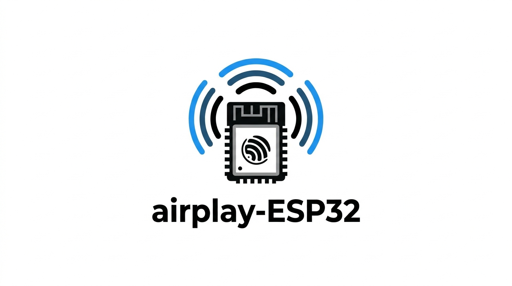

<div align="center">



# ESP32 AirPlay 2 Receiver

**Stream music from your Apple devices — or from any phone over Bluetooth — to any speaker for about $10**

[](https://github.com/wenghaoping/esp32-s3-airplay/stargazers)
[](https://github.com/wenghaoping/esp32-s3-airplay/network)
[](LICENSE)
[](https://docs.espressif.com/projects/esp-idf/)
[](https://www.espressif.com/en/products/socs)

### [Documentation](https://wenghaoping.github.io/esp32-s3-airplay/) · [Install from your browser](https://wenghaoping.github.io/esp32-s3-airplay/getting-started/flashing/) · [Troubleshooting](https://wenghaoping.github.io/esp32-s3-airplay/troubleshooting/)

</div>

---

## What is this?

This turns a cheap ESP32 board into a wireless AirPlay 2 speaker. Plug it into any
amplifier or powered speakers and it shows up on your iPhone, iPad or Mac just like a
HomePod or an AirPlay TV.

Works with **ESP32**, **ESP32-S2**, **ESP32-S3** and **ESP32-C5** chips, including the
[SqueezeAMP](https://github.com/philippe44/SqueezeAMP) (ESP32 + TAS5756) and
[Esparagus Audio Brick](https://sonocotta.com/espragus-audio-brick/) (ESP32 + TAS5825M)
boards, which have amplifiers built in.

ESP32-based boards also support **Bluetooth A2DP**, so anything that can pair with a
Bluetooth speaker can play to them when AirPlay is idle. The Esparagus Audio Brick
additionally supports **wired Ethernet** through an optional W5500 module.

**No cloud. No app. Just tap and play.**

## Quick start

The fastest route is the browser installer — no toolchain, no command line:

**[→ Install from your browser](https://wenghaoping.github.io/esp32-s3-airplay/getting-started/flashing/)**

Building from parts instead? You need an ESP32-S3 dev board, a PCM5102A DAC and a female
pin header, roughly $10 total, and no soldering. See the
[getting started guide](https://wenghaoping.github.io/esp32-s3-airplay/getting-started/).
The ESP32-S3 board used for this build is documented in the
[ESP32-S3 board manual](https://manuals.plus/ae/1005008669775924).

Building from source:

```bash
git clone --recursive https://github.com/wenghaoping/esp32-s3-airplay
cd esp32-s3-airplay
pio run -e esp32s3 -t upload
pio run -e esp32s3 -t uploadfs   # required — writes the web UI to SPIFFS
```

## Features

- **AirPlay 2** — appears natively in Control Center and every AirPlay-capable app
- **ALAC and AAC decoding** — live streaming (Siri, calls) and music playback
- **Multi-room** — PTP-based timing for synchronised playback
- **Bluetooth A2DP** — receive audio from phones and tablets (ESP32 boards only)
- **W5500 Ethernet** — wired networking with automatic WiFi failover
- **Web configuration** and **OTA updates** — USB is only needed for the first flash
- **48 kHz output** — optional 44.1 → 48 kHz conversion via a sinc resampler
- **Displays** — optional OLED or 320×170 colour TFT with track metadata
- **Hardware buttons** — optional play/pause, volume and track skip

Audio only, one speaker per board, and a decent WiFi signal is required.

## Documentation

| | |
| --- | --- |
| [Getting started](https://wenghaoping.github.io/esp32-s3-airplay/getting-started/) | Shopping list, assembly, flashing, first boot |
| [Supported boards](https://wenghaoping.github.io/esp32-s3-airplay/boards/) | SqueezeAMP, Esparagus Audio Brick, XIAO ESP32-C5, custom boards |
| [Features](https://wenghaoping.github.io/esp32-s3-airplay/features/bluetooth/) | Bluetooth, Ethernet, displays, buttons, AirPlay tuning |
| [Reference](https://wenghaoping.github.io/esp32-s3-airplay/reference/build-environments/) | Build environments, SPIFFS, OTA, architecture |
| [Troubleshooting](https://wenghaoping.github.io/esp32-s3-airplay/troubleshooting/) | No sound, no setup WiFi, dropouts, build errors |

## Contributing

See [CONTRIBUTING.md](CONTRIBUTING.md) and the
[contributing guide](https://wenghaoping.github.io/esp32-s3-airplay/contributing/).
Documentation lives in [`docs/`](docs/) and is built with [Zensical](https://zensical.org/)
— every page on the site has an edit link that takes you straight to the GitHub editor.

## Acknowledgements

- [Shairport Sync](https://github.com/mikebrady/shairport-sync) — the reference AirPlay implementation
- [openairplay/airplay2-receiver](https://github.com/openairplay/airplay2-receiver) — Python AirPlay 2 implementation
- [Espressif](https://github.com/espressif) — ESP-IDF framework and codec libraries

## Legal

**Non-commercial use only.** Commercial use requires explicit permission — see [LICENSE](LICENSE).

This is an independent project based on protocol analysis. Not affiliated with Apple Inc.
Not guaranteed to work with future iOS or macOS versions. Provided as-is without warranty.
