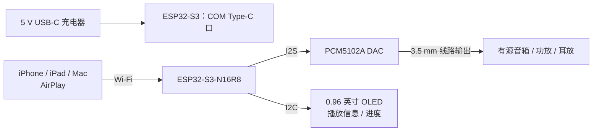

# ESP32-S3 AirPlay 音箱：硬件接线与到货指南

本指南适用于当前这块 **ESP32-S3-N16R8** 双 Type-C 开发板，以及计划购买的：

- **PCM5102A I2S DAC 音频模块**（推荐带 3.5 mm 音频插孔）；
- **0.96 英寸、4 针、I2C、128×64 黄蓝双色 OLED**；
- 母对母杜邦线；
- 5 V USB-C 手机充电器和 USB-C 线。

> 本项目的构建环境固定为 `esp32s3`。ESP32-S3 不能使用本项目的经典蓝牙音频接收功能；本方案的声音来源是 AirPlay，经 PCM5102A 输出到有源音箱、功放或耳放。

## 1. 购买前核对

### 1.1 PCM5102A DAC

确认模块带有如下输入针脚：

```text
VIN（或 VCC）、GND、BCK、DIN、LCK（也可能印为 LRCK / WS）
```

带 3.5 mm 音频插孔的版本最方便。不要购买只有功放输出、没有 I2S 输入的板子。

### 1.2 OLED 屏幕

确认商品描述写明：

```text
0.96 英寸 / 128×64 / I2C / 4 针 / SSD1306
```

黄蓝双色版本可以购买。它本质是单色 OLED：上方区域物理固定为黄色、下方固定为蓝色；程序只能控制像素亮灭，不能单独指定某段文字的颜色。

若商品标注为 `SH1106` 而非 `SSD1306`，仍可使用，但后续配置时要选择 SH1106 驱动。

### 1.3 还需要的配件

| 物品 | 建议 |
| --- | --- |
| 杜邦线 | 母对母，至少 12 根；建议购买 20 cm 彩色线一套。 |
| 电源 | 标准 5 V / 2 A USB-C 手机充电器。20 W、40 W 充电器也可，只要是标准 USB-C 充电器。 |
| USB-C 线 | 至少一根支持数据传输的线，便于刷机和看日志。 |
| 音频线 | 视音箱接口选择 3.5 mm AUX 线或 3.5 mm 转 RCA 线。 |

## 2. 整体连接关系



## 3. 供电方式

开发板照片中，底部有两个 Type-C 口：

- 标有 **`COM`** 的口：用于刷机、串口日志和日常供电，优先使用它；
- 标有 **`USB`** 的口：原生 USB 接口，本方案不需要使用它。

日常使用只需：

```text
墙上插座 → USB-C 充电器 → USB-C 线 → ESP32-S3 的 COM 口
```

20 W 或 40 W 充电器是可提供的最大功率，不会强行向板子输出 20 W 或 40 W。标准 USB-C 充电器在设备未协商快充时输出 5 V，因此可以使用。

不要：

- 同时给两个 Type-C 口供电；
- 同时从 Type-C 和 `5V` 针脚接两路电源；
- 将裸 3.7 V 锂电池直接接入 `5V` 或 USB-C；
- 使用将输出强制设为 9 V 或 12 V 的快充诱骗线。

## 4. 接线前的安全事项

1. **先断开 USB 电源**，完成所有杜邦线连接后再通电。
2. 按开发板和模块上的丝印找针脚，**不要按针脚数量猜位置**。
3. DAC、OLED 和 ESP32 必须有公共地线。
4. OLED 的 `VDD` 只能接 ESP32 的 `3V3`，不要接 `5V`。
5. 接线完成前，不要把耳机或音箱直接接到 ESP32 的 Type-C 或 GPIO 针脚。

## 5. PCM5102A DAC 接线

本项目 `esp32s3` 默认使用 GPIO11、GPIO12、GPIO13 输出 I2S 音频；无需修改固件引脚。

| ESP32-S3 丝印 | PCM5102A 丝印 | 用途 |
| --- | --- | --- |
| `5V` | `VIN` / `VCC` | DAC 供电 |
| `11`（GPIO11） | `BCK` | I2S 位时钟 |
| `12`（GPIO12） | `DIN` | I2S 音频数据 |
| `13`（GPIO13） | `LCK` / `LRCK` / `WS` | 左右声道时钟 |
| `14`（GPIO14） | `GND` | 固件配置为低电平的参考地 |
| `GND` | `GND` | 建议额外连接的公共地线 |

```text
ESP32-S3                         PCM5102A
────────                         ────────
5V       ──────────────────────  VIN
GPIO11   ──────────────────────  BCK
GPIO12   ──────────────────────  DIN
GPIO13   ──────────────────────  LCK / LRCK
GPIO14   ──────────────────────  GND
GND      ──────────────────────  GND（建议也接）
```

### DAC 接线注意

- PCM5102A 上的 `SCK` / `MCLK` **不需要连接**。
- DAC 的 3.5 mm 插孔是音频输出。接有源音箱、功放或耳放；不要接回 ESP32 的 USB 口。
- PCM5102A 是线电平输出：适合有源音箱的 `AUX` / `LINE IN`。无源音箱必须额外接功放板；耳机音量不足时需接耳放。
- 若完全无声，优先检查 DAC 的 `VIN` 是否真正得到 5 V。部分 ESP32-S3 开发板需要确认 VIN/VOUT 焊盘已连通。

## 6. OLED 接线

四针 OLED 从左到右常见丝印为：`GND`、`VDD`、`SCK`、`SDA`。其中 `SCK` 在此处表示 I2C 的时钟线（SCL），不是 PCM5102A 的音频时钟。

为避免与 DAC 和板载 RGB LED 冲突，本指南选择 GPIO17 和 GPIO18：

| OLED 丝印 | ESP32-S3 丝印 | 用途 |
| --- | --- | --- |
| `GND` | `GND` | 公共地线 |
| `VDD` | `3V3` | 屏幕供电 |
| `SCK` / `SCL` | `18`（GPIO18） | I2C 时钟 |
| `SDA` | `17`（GPIO17） | I2C 数据 |

```text
ESP32-S3                         0.96 英寸 I2C OLED
────────                         ─────────────────
3V3      ──────────────────────  VDD
GND      ──────────────────────  GND
GPIO18   ──────────────────────  SCK / SCL
GPIO17   ──────────────────────  SDA
```

## 7. 到货后的建议操作顺序

### 第一步：先测试现有 AirPlay 固件

先不要连接新模块，确认已经刷好的开发板可正常启动、能连 Wi-Fi、能出现在 iPhone / Mac 的 AirPlay 列表中。

### 第二步：只接 DAC，测试是否有声音

1. 断开 ESP32-S3 的 USB 电源。
2. 按第 5 节连接 PCM5102A。
3. 将 DAC 的 3.5 mm 输出连接到有源音箱的 AUX / LINE IN。
4. 接回 USB-C 电源，等待设备联网。
5. 从 iPhone / Mac 投放一首音乐，先将发送端和音箱的音量都调到较低值，再逐步提高。

若 DAC 连接正确，音频功能不需要重新刷固件。

### 第三步：再接 OLED，启用显示功能

OLED 默认在当前固件中是关闭的，因此接线后不会立即显示内容。需要启用配置并重刷**固件**。

#### 方法 A：通过 PlatformIO 菜单配置

在项目根目录执行：

```bash
pio run -e esp32s3 -t menuconfig
```

依次进入：

```text
AirPlay Receiver
→ Display Configuration
→ Enable display                设为启用
→ Display driver                选择 SSD1306 (128x64) OLED
→ Display height                选择 64 pixels (128x64)
→ Display bus                   选择 I2C
→ Display I2C SDA GPIO          填 17
→ Display I2C SCL GPIO          填 18
→ Display I2C address (7-bit)   填 0x3C
```

保存并退出；若屏幕商品明确标注 `SH1106`，将驱动改选 `SH1106 (128x64) OLED`。

#### 方法 B：修改默认配置文件（便于以后重建）

在 `config/sdkconfig.defaults.esp32s3` 文件末尾添加：

```ini
CONFIG_DISPLAY_ENABLED=y
CONFIG_DISPLAY_DRIVER_SSD1306=y
CONFIG_DISPLAY_HEIGHT_64=y
CONFIG_DISPLAY_BUS_I2C=y
CONFIG_DISPLAY_I2C_SDA=17
CONFIG_DISPLAY_I2C_SCL=18
CONFIG_DISPLAY_I2C_ADDR=0x3C
```

若之前已经构建过，PlatformIO 可能复用旧配置；删除缓存配置后再重建：

```bash
rm sdkconfig.esp32s3
pio run -e esp32s3 -t upload
```

如果没有生成 `sdkconfig.esp32s3`，`rm` 提示文件不存在可以忽略。

> 启用 OLED 后只需执行 `upload`，不必重复刷文件系统。若同时要把已修改的中文网页写进设备，再额外执行 `pio run -e esp32s3 -t uploadfs`。

## 8. OLED 能显示什么

启用后，屏幕会显示：

- AirPlay 就绪 / 已连接 / 播放 / 暂停状态；
- 歌曲名称、歌手、专辑；
- 播放进度条与已播放 / 总时长；
- 长文本自动滚动。

当前 OLED 字体主要覆盖英文、数字和常用符号。中文歌名或歌手名可能不能正确显示；这需要后续单独加入中文字体，会增大固件体积和内存占用。黄蓝双色 OLED 不会改变这一限制。

## 9. 常用刷机与监视命令

在项目根目录执行：

| 命令 | 作用 |
| --- | --- |
| `pio run -e esp32s3` | 仅编译，检查配置是否正确。 |
| `pio run -e esp32s3 -t upload` | 编译并写入固件；启用 OLED 后必须执行。 |
| `pio run -e esp32s3 -t uploadfs` | 写入网页管理界面和数据文件；修改网页后执行。 |
| `pio run -e esp32s3 -t monitor` | 打开串口日志，波特率为 115200；按 `Ctrl+C` 退出。 |

串口监视时，如果 OLED 初始化成功，会看到与 `display` 相关的初始化日志；若看到 I2C 错误，优先检查 SDA、SCL、3V3 和 GND 四根线。

## 10. 故障排查

| 现象 | 优先检查 |
| --- | --- |
| OLED 完全不亮 | 是否接了 `3V3` 和 `GND`；显示功能是否已启用并重新执行 `upload`。 |
| OLED 亮但没有内容 | 检查驱动是 SSD1306 还是 SH1106；检查 I2C 地址 `0x3C`，少数模块为 `0x3D`。 |
| OLED 出现乱码或错位 | 控制器或分辨率选择错误；确认是 128×64，不是 128×32。 |
| 屏幕显示中文歌名为空白 | 当前固件未包含中文字库，英文元数据和状态信息仍可正常显示。 |
| AirPlay 能发现但没有声音 | 检查 PCM5102A 的 5V、BCK、DIN、LCK 和 GND；确认音箱接的是 DAC 的线路输出。 |
| 声音小 | 先提高 iPhone/Mac AirPlay 音量和有源音箱音量；确认接入 AUX / LINE IN。必要时在 DAC 与音箱之间加线路前级。 |
| 有杂音或断音 | 缩短杜邦线，确保公共地线可靠；让 ESP32 靠近路由器，避免电源线和音频线缠绕。 |

## 11. 完成后的固定使用方式

接线确认无误后，可将 ESP32、DAC 和 OLED 固定到绝缘底板或 3D 打印外壳中。日常使用时只要：

1. 给 `COM` Type-C 口接 5 V USB-C 电源；
2. 等待设备自动连接保存的 Wi-Fi；
3. 在 iPhone、iPad 或 Mac 的 AirPlay 菜单中选择你的设备名称；
4. 使用 DAC 的 3.5 mm 输出接有源音箱、功放或耳放。

不建议将裸露模块直接放在金属桌面、金属外壳或潮湿环境中使用。
