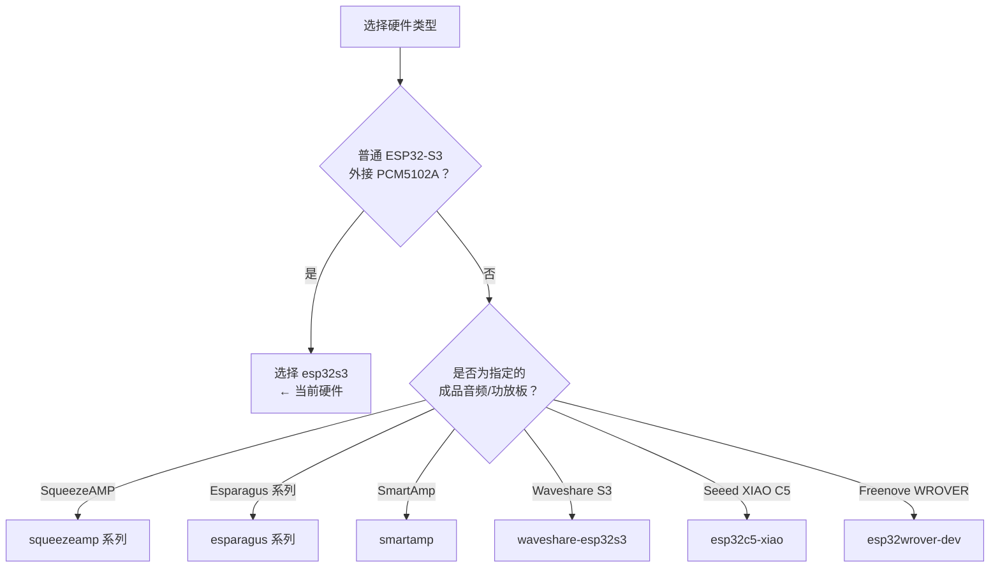

# PlatformIO 构建环境与固件变体说明

PlatformIO 左侧栏里显示的 `esp32s3`、`squeezeamp-bt`、`smartamp` 等名称，不是需要全部安装的多个功能包，而是同一套 AirPlay 接收器源码针对不同硬件生成的**构建环境**。

每个环境会决定：

- 使用哪一类 ESP 芯片；
- Flash 容量和分区表；
- 板子上 I2S、功放、网口、LED 等针脚；
- 是否编译经典蓝牙 A2DP 接收功能；
- 使用外接 DAC，还是某种已经集成了 DAC / 功放的成品音频板。

一次只选择**一个**与实际硬件匹配的环境编译和刷入。

## 给当前硬件的结论

当前使用的硬件是：

```text
ESP32-S3-N16R8 开发板（16 MB Flash / 8 MB PSRAM）
+ 外接 PCM5102A I2S DAC
+ 可选 0.96 英寸 I2C OLED
```

应始终使用：

```text
esp32s3
```

`Default` 只是 PlatformIO 的默认任务集合；本项目的默认环境本身就是 `esp32s3`。



## 命名规则

| 后缀或词语 | 含义 |
| --- | --- |
| `-bt` | 在**原版 ESP32**上启用经典蓝牙 A2DP 音频接收。ESP32-S3 不支持这种模式。 |
| `-s3` | 面向 ESP32-S3 的版本。 |
| `-4m` | 面向仅有 4 MB Flash 的硬件，功能和存储空间更紧。 |
| `dual-dac` | 两个 DAC / 功放芯片的板子，支持立体声加低音炮或双功放接法。 |
| `jtag` | 仅改变上传方式，使用芯片内置 USB-JTAG，不代表另一种音频功能。 |

## 所有当前可见构建环境

### 1. 通用开发板

| 环境 | 硬件 | 主要用途 | 是否适合当前硬件 |
| --- | --- | --- | --- |
| `esp32s3` | 通用 ESP32-S3，16 MB Flash | 外接 I2S DAC，例如 PCM5102A；项目默认环境。 | **是，选择它。** |
| `esp32s3-jtag` | 同一类 ESP32-S3 | 固件功能与 `esp32s3` 基本相同，仅通过内置 USB-JTAG 上传。 | 通常不需要。 |
| `waveshare-esp32s3` | Waveshare ESP32-S3 特定板型 | Waveshare 板的针脚、屏幕/供电安排与通用板不同。 | 否。 |
| `esp32c5-xiao` | Seeed XIAO ESP32-C5 | ESP32-C5 是不同芯片与不同小板；该环境使用专门的平台支持。 | 否。 |
| `esp32wrover-dev` | Freenove ESP32 WROVER | 原版 ESP32、4 MB Flash 的开发板，含经典蓝牙音频输入配置。 | 否，芯片不同。 |

#### `esp32s3` 与 `esp32s3-jtag` 的区别

两者输出的 AirPlay 功能基本一致，差异只在上传通道：

```text
esp32s3       → 常规串口刷机方式，通常使用板上标为 COM 的 Type-C 口
esp32s3-jtag  → 内置 USB-JTAG 刷机方式，通常使用板上标为 USB 的 Type-C 口
```

当前 `esp32s3` 已能正常编译、刷机和查看日志，因此无需切换为 `esp32s3-jtag`。

### 2. SqueezeAMP 系列

SqueezeAMP 是已经集成 ESP32 与 TAS5756 音频功放的专用成品板，不使用普通 PCM5102A 的接线方式。

| 环境 | 硬件要求 | 特点 | 是否适合当前硬件 |
| --- | --- | --- | --- |
| `squeezeamp` | 8 MB Flash SqueezeAMP | TAS5756 功放板的基础 AirPlay 版本。 | 否。 |
| `squeezeamp-bt` | 8 MB Flash SqueezeAMP | 基础版本加经典蓝牙 A2DP 音频接收。 | 否。 |
| `squeezeamp-4m` | 4 MB Flash SqueezeAMP | 为 4 MB Flash 型号缩减配置，蓝牙不包含在内。 | 否。 |

### 3. Esparagus Audio Brick 系列

Esparagus Audio Brick 是集成 TAS58xx 功放的专用音频板。它的 I2S、功放控制与普通 ESP32-S3 + PCM5102A 不同，不能混用配置。

| 环境 | 硬件要求 | 特点 | 是否适合当前硬件 |
| --- | --- | --- | --- |
| `esparagus-audio-brick` | 原版 ESP32 Audio Brick | TAS58xx 功放板的基础版本。 | 否。 |
| `esparagus-audio-brick-bt` | 原版 ESP32 Audio Brick | 加经典蓝牙 A2DP 接收；可同时支持该板的 W5500 有线网功能。 | 否。 |
| `esparagus-audio-brick-s3` | ESP32-S3 Audio Brick | S3 版本的 Audio Brick，使用板载 TAS58xx 功放。 | 否。 |
| `esparagus-audio-brick-dual-dac` | ESP32-S3 Audio Brick Dual | 两颗 TAS58xx 功放：可用作立体声 + 单声道低音炮，或第二对立体声输出。 | 否。 |

### 4. Esparagus Louder 系列

Esparagus Louder 也是带 TAS58xx 功放的专用音频板，与 Audio Brick 的硬件针脚/形态不同。

| 环境 | 硬件要求 | 特点 | 是否适合当前硬件 |
| --- | --- | --- | --- |
| `esparagus-louder` | 原版 ESP32 Louder | TAS58xx 功放板基础版本。 | 否。 |
| `esparagus-louder-bt` | 原版 ESP32 Louder | 加经典蓝牙 A2DP 接收。 | 否。 |
| `esparagus-louder-s3` | ESP32-S3 Louder | ESP32-S3 版本，使用板载 TAS58xx 功放。 | 否。 |

### 5. SmartAmp

| 环境 | 硬件要求 | 特点 | 是否适合当前硬件 |
| --- | --- | --- | --- |
| `smartamp` | 4 MB Flash 的 SmartAmp 专用板 | 原版 ESP32 的 SmartAmp 配置，包含经典蓝牙 A2DP 接收。 | 否。 |

## 常用操作命令

下列命令中的 `<环境名>` 替换为实际需要的构建环境。对当前硬件，应直接使用 `esp32s3`。

| 命令 | 作用 |
| --- | --- |
| `pio run -e esp32s3` | 只编译 `esp32s3` 固件，不写入开发板。 |
| `pio run -e esp32s3 -t upload` | 编译并通过 USB 写入应用固件。 |
| `pio run -e esp32s3 -t uploadfs` | 写入网页管理界面、中文页面等 SPIFFS 文件。 |
| `pio run -e esp32s3 -t monitor` | 打开串口日志，帮助排查网络、OLED、DAC 等问题。 |
| `pio run -e esp32s3 -t menuconfig` | 打开配置菜单，例如启用 OLED。 |

## 常见误区

### 不要为了“多功能”刷其他环境

例如 `squeezeamp-bt` 不是在通用 S3 上增加蓝牙的固件。它假定板上有原版 ESP32、TAS5756 功放和对应针脚；刷到当前 S3 板上无法正常工作。

### `-bt` 不能给 ESP32-S3 增加蓝牙音频

经典蓝牙音频 A2DP 需要原版 ESP32 的蓝牙硬件。ESP32-S3 只有 BLE，不支持该项目的 `-bt` 功能。

### 不匹配的环境可能无法启动或没有声音

即使某个固件看似可以写入，也可能因为芯片、Flash 容量、分区表或 DAC 引脚不匹配而无法启动、不能联网或没有声音。因此只选择实际板型对应的环境。

## 本项目当前选择清单

| 使用场景 | 选择 |
| --- | --- |
| 日常编译、刷机、DAC 输出 | `esp32s3` |
| 启用 PCM5102A | 仍是 `esp32s3`，无需换环境。 |
| 启用 0.96 英寸 OLED | 仍是 `esp32s3`，在菜单中启用显示配置。 |
| 写入中文网页 | 仍是 `esp32s3`，执行 `uploadfs`。 |
| 换 Wi-Fi 或恢复设置 | 无需重新选择或刷写其他环境。 |

一句话总结：**除非更换了整块硬件板型，否则对当前 ESP32-S3-N16R8 + PCM5102A 方案，始终选择 `esp32s3`。**
