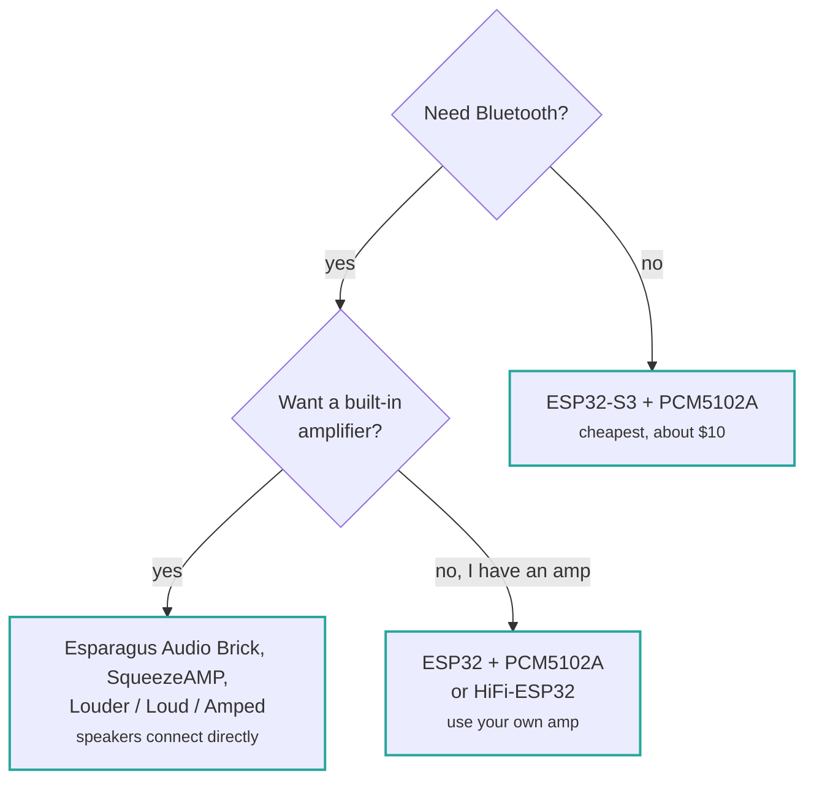

# 支持的开发板

请选择与硬件匹配的页面。 If you 是 building 从 parts rather than 使用 an
integrated 开发板, you want [ESP32-S3 + PCM5102A](esp32s3-pcm5102a.md).

## 我应该购买哪块开发板？

If you already own one of these, 只需 find it in 该 table below. If you 是 starting 从
nothing, 该 仅 question that really matters 是 whether you 需要 蓝牙.

简而言之： **buy an ESP32-S3** unless you 需要 蓝牙, in 该 case you 需要 an
original ESP32.

| Board | Chip | DAC / amp | 蓝牙 | 以太网 | Prebuilt binary |
| --- | --- | --- | :-: | :-: | :-: |
| [ESP32-S3 + PCM5102A](esp32s3-pcm5102a.md) | ESP32-S3 | External I2S | — | — | yes |
| [Waveshare ESP32-S3](esp32s3-pcm5102a.md#waveshare-esp32-s3) | ESP32-S3 | External I2S | — | — | yes |
| [SqueezeAMP](squeezeamp.md) | ESP32 | TAS5756 | yes | — | yes |
| [Esparagus Audio Brick](esparagus-audio-brick.md) | ESP32 / S3 | TAS58xx | ESP32 仅 | yes | yes |
| [Esparagus Audio Brick Dual](esparagus-audio-brick-dual-dac.md) | ESP32-S3 | 2× TAS58xx | — | yes | yes |
| [Esparagus Louder](esparagus-audio-brick.md#esparagus-louder) | ESP32 / S3 | TAS58xx | ESP32 仅 | yes | yes |
| [HiFi-ESP32](hifi-esp32.md) | ESP32 / S3 | PCM5100, line level | ESP32 仅 | yes | yes |
| [HiFi-Esparagus](hifi-esp32.md) | ESP32 / S3 | PCM5100, line level | ESP32 仅 | — | yes |
| [Loud-ESP32](loud-esp32.md) | ESP32 / S3 | MAX98357A | ESP32 仅 | yes | yes |
| [Loud-Esparagus](loud-esp32.md) | ESP32 | 2× MAX98357A | yes | — | yes |
| [Esparagus Echo](loud-esp32.md) | ESP32-S3 | 2× MAX98357A | — | yes | yes |
| [Amped-ESP32](amped-esp32.md) | ESP32 / S3 | PCM5100 + TPA31xx | ESP32 仅 | yes | yes |
| [Amped-Esparagus](amped-esp32.md) | ESP32 | PCM5100 + TPA31xx | yes | yes | yes |
| [Louder-ESP32](louder-esp32.md) | ESP32 / S3 | TAS5805M | ESP32 仅 | yes | yes |
| [Louder-ESP32-Plus](louder-esp32.md) | ESP32 / S3 | TAS5825M | ESP32 仅 | yes | yes |
| [Seeed XIAO ESP32-C5](xiao-esp32c5.md) | ESP32-C5 | External I2S | — | — | — |
| [自定义开发板](custom.md) | any | any | — | — | — |

**经典蓝牙 A2DP 仅在原版 ESP32 上可用。** 该 ESP32-S3, S2 和
C5 have 蓝牙 LE 仅, 或 no 蓝牙 at all, so A2DP 是 not possible on them. If
蓝牙 matters to you, 选择 an ESP32-based 开发板.

## Choosing a 芯片

| Chip | 说明 |
| --- | --- |
| **ESP32-S3** | 该 best 默认. Plenty of PSRAM, native USB, actively developed against. |
| **ESP32** | Choose this 用于 蓝牙 A2DP. Tighter on RAM, so 音频 buffers 是 halved. |
| **ESP32-S2** | Works, but single core 和 no 蓝牙. Prebuilt binary 可用. |
| **ESP32-C5** | Dual-band WiFi 6, RISC-V. Needs a community PlatformIO platform — see [its 页面](xiao-esp32c5.md). |
| **ESP32-P4** | Experimental. A `config/sdkconfig.defaults.esp32p4` exists but there 是 no PlatformIO 环境. |

## 完整构建环境列表

Every PlatformIO 环境, including variants 无需 prebuilt binaries, 是 listed in
[构建 环境](../reference/build-environments.md).
