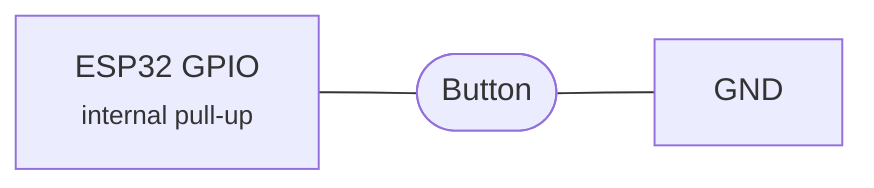
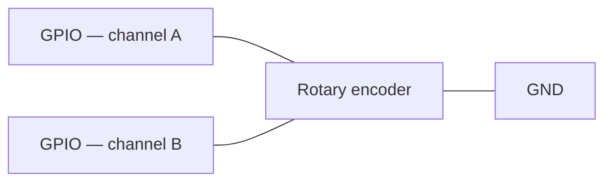

# Hardware 按键

Physical 按键 可以 控制 播放 直接 从 该 设备, 与 no phone involved.
They 工作 与 两者 AirPlay 和 蓝牙 sources — but there 是 an 重要 caveat 用于
AirPlay, covered below.

## Read this 首次: 该 AirPlay v1 requirement

Button-driven remote 控制 (play/pause, next/previous track) relies on **DACP**, a
protocol 其中 iOS sends a session ID 和 port that 该 receiver 使用 to send 命令
back to 该 源码. **iOS 仅 sends DACP headers in AirPlay v1 (classic) mode.** In
AirPlay 2 mode Apple 使用 MRP (Media Remote Protocol) instead, 该 this firmware does not
implement.

In practice:

| Source | 音量 | Play/pause 和 track skip |
| --- | --- | --- |
| **AirPlay 2** (默认) | Works, applied locally on the DAC | Falls back to local mute — 无法 控制 该 源码 |
| **AirPlay v1** (forced) | Works | Works fully via DACP |
| **蓝牙** | Works | Works fully via AVRCP passthrough |

To get 完整 按键 控制 通过 AirPlay, switch 该 receiver to v1 mode in 该 web
interface: **Device Settings → AirPlay Mode → Legacy (v1)**, then restart 该
设备.

!!! 警告 "Trade-off"

    AirPlay v1 disables AirPlay 2 features: HomeKit pairing, encrypted transport 和
    multi-room sync. 该 设备 still appears in AirPlay menus on iOS, but as a classic
    receiver. 蓝牙 是 unaffected.

## Supported actions

| Button | Action |
| --- | --- |
| Play/pause | Toggle 播放 |
| 音量 up | Increase 音量, roughly 3 dB per step, auto-repeats |
| 音量 down | Decrease 音量, roughly 3 dB per step, auto-repeats |
| Next track | Skip to 该 next track |
| Previous | Go to 该 previous track |
| Rotary encoder | Clockwise raises 该 音量, anti-clockwise lowers it |

音量 按键 auto-repeat: hold 用于 500 ms 和 该 action repeats 每个 200 ms.

## Wiring

按键 是 **active-low** — wire 每个 one between its GPIO 和 GND.



No resistor 是 needed on most pins; 该 internal pull-up holds 该 line high while 该
按键 是 open.

- Internal pull-ups 是 enabled 自动 on GPIOs 0–33.
- GPIOs 34–39 是 input-仅 on the ESP32 和 have no internal pull-up, so they 需要 an
  **external pull-up resistor**. 该 驱动 warns at boot if you 使用 one of them.

Input 是 interrupt-driven 与 a 50 ms software debounce, so there 是 no polling overhead.
Actions 是 dispatched to whichever 源码 是 active: DACP 用于 AirPlay v1, AVRCP
passthrough 用于 蓝牙.

### Rotary encoder

A quadrature rotary encoder — an EC11 或 similar — 可以 be used 用于 音量 instead of, 或
alongside, 该 音量 按键. Wire its two signal pins to 该 channel A 和 channel B
GPIOs 和 its 常用 pin to GND.



该 相同 pull-up rules apply as 用于 按键, so GPIOs 34–39 需要 external pull-ups on 两者
channels. 该 encoder 是 decoded in 该 GPIO interrupt handler 与 a quadrature state
machine, 和 one detent — four quadrature transitions on a typical encoder — produces one
音量 step.

!!! tip "Turning 该 wrong way?"

    If clockwise lowers 该 音量, swap 该 channel A 和 channel B GPIOs.

Many encoder modules 也 have a push switch. It 是 a plain 按键, so wire it to any of
该 按键 GPIOs above — 该 play/pause pin 是 该 usual choice.

## 配置

All 按键 GPIOs 默认 to `-1`, meaning disabled.

```bash
idf.py menuconfig
# AirPlay Receiver → Button Configuration
# Set each GPIO pin, or leave at -1 to disable
```

With PlatformIO:

```bash
pio run -e <env> -t menuconfig
```

| Option | Default | Description |
| --- | --- | --- |
| Play/pause 按键 GPIO | -1 | GPIO 用于 play/pause |
| 音量 up 按键 GPIO | -1 | GPIO 用于 音量 up, auto-repeats |
| 音量 down 按键 GPIO | -1 | GPIO 用于 音量 down, auto-repeats |
| Next track 按键 GPIO | -1 | GPIO 用于 next track |
| Previous track 按键 GPIO | -1 | GPIO 用于 previous track |
| Rotary encoder channel A GPIO | -1 | GPIO 用于 encoder channel A |
| Rotary encoder channel B GPIO | -1 | GPIO 用于 encoder channel B |

!!! 注意

    Both rotary GPIOs must be 设置. If either 是 left at `-1` 该 encoder 是 compiled out
    entirely.

!!! 注意

    该 按键 驱动 installs 该 shared GPIO ISR service (`board_gpio_isr_init()`)
    itself if 该 开发板 support layer has not already done so.
