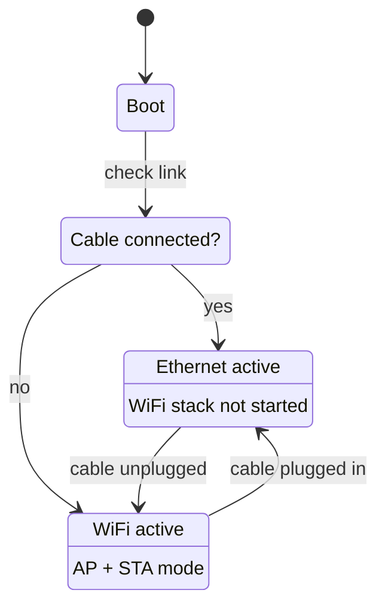

# 以太网 (W5500)

该 [Esparagus Audio Brick](../boards/esparagus-audio-brick.md) supports wired 以太网
through a **W5500 SPI module**, giving a reliable low-latency 连接 其中 WiFi 是
unreliable 或 unavailable.

## How it 有效

以太网 是 checked 首次 at boot. If a cable 是 已连接, WiFi 是 skipped entirely.
Unplug 该 cable at runtime 和 WiFi starts 自动 as a fallback; plug it back in
和 以太网 takes 通过 again.



该 web interface 显示 "以太网" 或 "WiFi" depending on the 是 active, 和 AirPlay 和
蓝牙 behave identically on either.

## Wiring

该 W5500 connects 通过 SPI, sharing 该 clock 和 MOSI lines 与 该 OLED 显示屏. 该
ESP32 和 ESP32-S3 revisions of 该 Brick 使用 不同 pins.

| W5500 pin | ESP32 | ESP32-S3 | 功能 |
| --- | :-: | :-: | --- |
| CLK | 18 | 12 | SPI clock |
| MOSI | 23 | 11 | SPI data out |
| MISO | 19 | 13 | SPI data in |
| CS | 5 | 10 | Chip 选择 |
| INT | 35 | 6 | Interrupt |
| RST | 14 | 5 | Hardware reset |
| 3V3 | 3.3 V | 3.3 V | Power |
| GND | GND | GND | Ground |

## 配置

以太网 是 enabled by 默认 in 每个 Esparagus Audio Brick 构建, on 两者 revisions.
GPIOs 可以 be changed under **Board 配置 → SPI 和 以太网 配置** in
`menuconfig`.

To disable it, 设置:

```ini
CONFIG_ETH_W5500_ENABLED=n
```

When disabled, all 以太网 code 是 compiled out — no impact on 刷写 size 或 RAM.

!!! 注意 "MAC address"

    该 W5500 has no factory MAC address. 该 firmware derives a unique one 从 该
    ESP32's base MAC 使用 `ESP_MAC_ETH`, so 每个 开发板 gets a stable, unique 以太网
    MAC.
