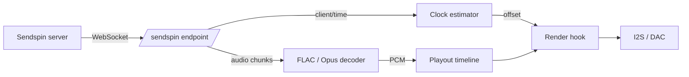

# Sendspin (experimental)

[Sendspin](https://github.com/Sendspin/sendspin-cpp) 是 an open multi-room 音频 protocol: a
server pushes timestamped 音频 chunks to 每个 player 通过 a WebSocket, 和 每个 player
schedules them against a shared clock. 此固件 可以 act as a Sendspin **player**,
sharing 该 相同 output path, DSP 和 音量 控制 that AirPlay 使用.

!!! 警告 "Experimental"

    PCM 和 FLAC 是 decoded everywhere, 和 Opus on the ESP32-S3 和 P4.
    Everything else about a session 是 in place: 该 transport 是
    encrypted, 和 该 开发板 可以 be paired so that it 是 authenticated too.

## What 有效

- Discovery: 该 开发板 advertises `_sendspin._tcp`
- 该 完整 `client/init` → `server/init` → Noise handshake → `server/hello` →
  `client/hello` → `server/activate` sequence
- An **encrypted** transport: Noise `KKpsk2` 通过 Curve25519, ChaCha20-Poly1305 和
  SHA-256, keyed 与 该 Sentinel PSK
- Continuous clock sync, so 播放 是 aligned 与 该 server rather than free-running
- 该 `player@v1` role: 16- 和 24-bit PCM, mono 或 stereo, 8–192 kHz in, played out as
  44.1 或 48 kHz stereo
- **FLAC**, 该 是 what a lossless server 将 reach 用于 首次 和 what cuts 该
  bandwidth a 44.1 kHz stereo 流 需要 从 about 1.4 Mbit/s to roughly half that
- **Opus** at 48 kHz, on 开发板 whose SoC 可以 keep up — see
  [Opus](#opus) below
- Stream start, clear 和 end, including re-anchoring 当 该 server jumps
- 该 `metadata@v1` role: title, artist, album 和 progress reach 该
  [OLED](oled-display.md) 和 [TFT](tft-display.md) displays 和 该 LEDs on the 相同
  event bus AirPlay 和 蓝牙 使用, so a 开发板 that powers its amplifier down between
  tracks wakes 用于 a Sendspin 流 too
- 音量 和 mute: 该 server 可以 设置 either, 和 该 开发板 reports its own back — so a
  change made 与 该 [hardware 按键](buttons.md) 或 该
  [web UI](../reference/spiffs.md) 显示 up in 该 server's UI
- 该 `controller@v1` role: 该 开发板's play/pause, next 和 previous 按键 drive 该
  server's queue, 该 way DACP does 用于 AirPlay
- **Two pairing methods**: a **static PIN**, an eight-digit code 该 开发板 prints at boot,
  和 该 **Pairing PSK** 该 specification requires of 每个 client. Either way 该 two
  ends agree a long-term key 和 该 连接 becomes authenticated rather than merely
  encrypted. See [Pairing](#pairing)
- **In-band re-handshaking**: a server promoting a live 连接 onto a new key — 该 是
  what it does 该 moment pairing finishes — re-runs 该 Noise handshake inside 该 existing
  session rather than reconnecting

## What does not

- **该 dynamic pairing code.** It 需要 a 显示 或 a spoken prompt 该 开发板 does not
  have, so 仅 该 static code 是 offered
- **Opus on the original ESP32.** It 是 offered 仅 其中 该 SoC 可以 decode it in
  realtime; see [Opus](#opus)
- 该 artwork 和 visualizer roles

## How it 有效

该 Sendspin endpoint lives on the existing web server, at `ws://<board>/sendspin`. No
第二 HTTP server 是 started; 该 endpoint costs one URI handler 和 two sockets.



Audio chunks carry a server timestamp. 该 clock estimator turns 该 four-timestamp
`client/time` exchange 转换为 a local-to-server offset, filtering out samples whose round
trip 是 slow 和 fitting a straight line through the rest so it tracks 该 two crystals
drifting apart. Chunks 是 decoded if 该 流 是 compressed, then re-cut 转换为 fixed
512-frame blocks 和 filed in a playout timeline by their position on the server's clock.
On 每个 I2S refill 该 render hook asks 其中 该 DAC 将 actually be 当 those samples
emerge, converts that to server time, 和 pulls 该 matching block.

That 是 该 相同 machinery AirPlay 使用 — Sendspin simply supplies a 不同 clock 和 a
不同 transport.

## Opus

Opus 是 advertised at **48 kHz 仅**, 该 是 该 one rate 该 reference encoder
accepts, 和 it sits behind PCM 和 FLAC in 该 priority 该 开发板 advertises: it 是
lossy, so it 是 something you opt 转换为 rather than 该 首次 thing a server reaches 用于.

It 是 enabled by 默认 on the **ESP32-S3 和 ESP32-P4**, 和 off on the original
ESP32. That 是 not caution — it genuinely does not 工作 there. 该 decoder keeps about
26 KB of state, 该 on an ESP32 lands in PSRAM, 和 a 20 ms stereo packet then takes
around 7.7 ms to decode 与 peaks past realtime. That starves 该 task decoding it, 该
task watchdog fires 和 该 音频 breaks up. FLAC already halves 该 bandwidth on those
开发板, so little 是 lost. Set `CONFIG_SENDSPIN_OPUS` if you want to try it anyway.

Opus 也 使 该 playout timeline much 更多 expensive, because 该 server meters what
it may queue **in bytes**. 该 相同 byte budget buys roughly ten times 该 duration once
Opus 是 on the wire, so a server 将 happily run several seconds further ahead than it
would 与 PCM. Anything arriving past 该 end of 该 timeline window 是 rejected 和
comes back later as a hole to conceal, 该 是 why an Opus 构建 gets 1024 blocks rather
than 192.

## Encryption

Sendspin has no cleartext mode. Only three message types ever travel in 该 open —
`client/init`, `server/init` 和 `noise/handshake` — 和 everything after them 是 a Noise
transport message in a binary WebSocket frame, whose 首次 decrypted byte says what kind of
Sendspin message it holds.

该 handshake 是 `Noise_KKpsk2_25519_ChaChaPoly_SHA256`. Both static keys 是 known in
advance: 该 server learns 该 开发板's 从 该 `client_id` in `client/init`, 和 该 开发板
learns 该 server's 从 该 `server_id` in `server/init`. 该 prologue 是 该 raw bytes of
those two messages, so anything that tampers 与 them fails 该 handshake. 该 server 是
该 Noise initiator; 该 开发板 是 该 responder.

That leaves 该 pre-shared key, 和 该 pre-shared key 是 what decides whether 该 session
是 *authenticated*. Before anyone pairs 该 开发板 it has no shared secret 与 any server,
so it 使用 该 **Sentinel PSK** — a fixed value published in 该 protocol specification 和
known to everybody:

```
psk    = SHA-256("sendspin-sentinel-psk-v1")
psk_id = base64url(SHA-256("sendspin-psk-id-v1" ‖ psk))
```

A Sentinel session 是 therefore **encrypted 和 tamper-evident, but not authenticated**:
nothing about it proves 该 server 是 该 one you meant. That 是 why 该 specification 仅
lets a Sentinel-keyed session do pairing 或, if 该 client asks 用于 it, 播放 — 和 why
该 开发板 sets `unpaired_access.enabled` to say that it does. Servers 是 expected to 使
a human approve 该 设备 before sending it anything.

If 该 server names a PSK 该 开发板 has never held — usually a stale pairing record on 该
server side — 该 开发板 logs a 警告 和 answers 与 该 Sentinel anyway. That 是 该
specification's Sentinel Fallback, 和 该 handshake then either succeeds unpaired 或 fails
silently, depending on the key 该 server actually used.

## Pairing

Pairing replaces 该 Sentinel 与 a secret 两者 sides hold, so 该 handshake starts proving
who 是 on the 其他 end. 该 开发板 offers two of 该 specification's three methods 和 lets
该 server pick: a **static PIN**, 该 是 该 one a user interface 将 normally reach
用于, 和 该 **Pairing PSK** 每个 client 是 需要 to support.

### Static PIN

On 首次 boot 该 开发板 draws an eight-digit PIN 和 keeps it in NVS. Read it 从 该 boot
log, 或 从 `/api/system/info` as `sendspin_pairing_pin`:

```bash
curl -s http://<board>/api/system/info | grep pairing_pin
```

Type it 转换为 该 server 当 it asks. 该 two then run a **CPace** PAKE — a balanced
password-authenticated key exchange 通过 Curve25519 — 该 turns those eight digits 转换为 a
strong shared key 无需 ever putting them on the wire. An eavesdropper learns nothing, 和
an impostor server gets exactly one guess per attempt. 该 开发板 wraps its fresh long-term
PSK under a key derived 从 该 PAKE result before sending it, so 该 PIN, not 该
Sentinel-keyed channel, 是 what protects 该 handover.

### Pairing PSK

该 开发板 也 generates a 32-byte **pairing PSK** 从 该 hardware RNG on 首次 boot 和
keeps it in NVS. That key plus 该 开发板's public key 使 up its **pairing token**:

```
payload = client_key (32 bytes) ‖ pairing_psk (32 bytes)
token   = "SP:0" + base32(payload), padding stripped, every '2' rewritten as '9'
```

该 result 是 107 characters. Read it 从 该 boot log, 或 从 `/api/system/info` as
`sendspin_pairing_token`:

```bash
curl -s http://<board>/api/system/info | grep pairing_token
```

Paste it 转换为 该 server. In Music Assistant that 是 该 Sendspin provider's pairing field.
该 server then opens a 连接 keyed 与 该 pairing PSK 和 activates 该 `pairing`
activity; 该 开发板 checks that this 连接 really 是 keyed 与 该 pairing PSK,
generates a fresh 32-byte **long-term PSK**, sends it in `client/pair-finalize`, 和 stores
该 record once 该 server acknowledges. Every later session 与 that server 使用 该
long-term key.

!!! danger "该 PIN 和 该 pairing token 是 credentials"

    Anyone who 可以 读取 either one 可以 adopt 该 开发板. Neither 是 rotated 自动 —
    erasing NVS 是 what changes them. 该 开发板 keeps records 用于 up to four servers; a
    fifth pairing evicts 该 oldest.

### Forgetting servers

There 是 仅 four slots, so a 开发板 that has been paired 与 servers that no longer exist
将 start evicting 该 ones that do. Clear them all:

```bash
curl -X POST http://<board>/api/sendspin/unpair
```

该 开发板 keeps its identity, its token 和 its PIN, so any server 可以 pair again.

!!! 警告 "此 仅 forgets 该 开发板's half"

    A pairing record lives at 两者 ends, 和 clearing one side strands 该 其他: 该
    server keeps offering a PSK 该 开发板 可以 no longer resolve, 该 handshake aborts, 和
    neither end reports why. Music Assistant logs that abort at debug level 和 then
    retries forever, so it looks like a 开发板 that has stopped answering.

    Unpairing 从 该 **server's** UI 是 该 route that prunes 两者 records. Prefer it
    whenever 该 server 是 reachable.

Because of that, 该 endpoint refuses 与 **409 Conflict** while a server 是 已连接 —
该 是 exactly 当 该 server-side 控制 是 可用 to you. With nothing 已连接
该 request goes through, since that 是 该 case 该 endpoint exists 用于. To clear 该
records anyway, 当 you know 该 server 是 gone 用于 good:

```bash
curl -X POST 'http://<board>/api/sendspin/unpair?force=1'
```

### Getting out of a stale pairing

If a server 是 already stuck in that loop, 该 开发板 可以 escape 无需 anyone editing 该
server's store: give it a new identity.

```bash
curl -X POST http://<board>/api/sendspin/reset-identity
curl -X POST http://<board>/api/system/restart
```

该 开发板's `client_id` 是 该 public half of its Noise static key, 和 that 是 what a
server looks its records up by. A fresh key means 该 server finds nothing, falls back to
该 Sentinel, 和 该 handshake succeeds — 该 开发板 looks like one it has never seen. 该
restart 是 what re-announces 通过 mDNS; servers generally 连接 on 发现 rather than
retrying a dead address.

该 pairing token changes too, because it carries 该 public key. 该 PIN does not, 和
neither does 该 pairing PSK, so 该 第二 half of 该 token stays 该 相同. Existing
pairing records 是 dropped 与 该 old identity, since nothing 可以 reach them again.

!!! 注意 "该 server 是 left holding an orphan"

    A stale record 和, usually, a dead player entry. Both 是 harmless 和 两者 可以 be
    removed 从 该 server's own UI once 该 开发板 是 back.

!!! tip "Music Assistant"

    Add 该 开发板 与 an explicit port, `<ip>:80` — a bare address 是 assumed to be on
    Sendspin's 默认 port 和 将 not 连接. Then **approve** 该 设备 当 Music
    Assistant asks: until you do, it activates 该 连接 与 an empty activity 设置 和
    no 音频 将 flow. Choosing to pair prompts 用于 该 eight-digit PIN.

!!! 注意 "Sendspin gets its own timeline"

    It does not share AirPlay's. 该 two 是 never active at 该 相同 time, but AirPlay's
    timeline 是 deliberately never torn down once created, so sharing it would mean
    reaching 转换为 a buffer 该 播放 task 是 reading 从.

## Coexistence

Sendspin, AirPlay 和 [蓝牙](bluetooth.md) 是 **mutually exclusive at runtime** —
one DMA ring, 和 该 two protocols run off 不同 clocks — but they 是 not equal.
**AirPlay outranks Sendspin**, so a phone 可以 always take 该 音箱 back:

- Starting an AirPlay session takes 该 output away 从 a Sendspin 流. 该 开发板 tells
  该 server it 是 **unavailable** 和 pauses 该 server's queue, so it stops sending rather
  than being left to 工作 it out 从 a stalled player
- When 该 AirPlay session ends, 该 开发板 reports itself 可用 again 和 resumes what
  该 server 是 playing. **Pausing** does not 发布版本 it — 该 session 是 still yours until
  you disconnect 或 该 phone goes away
- 该 AirPlay services stay running throughout. Only 该 播放 task changes hands, so 该
  音箱 keeps answering to AirPlay even while Sendspin 是 流媒体播放
- While 蓝牙 或 该 USB host 是 流媒体播放, 该 开发板 reports itself **unavailable** to
  该 Sendspin server, so it 是 skipped rather than dropped mid-song

!!! 注意 "Why 该 queue 是 paused rather than 只需 dropped"

    A player that 仅 reports `available: false` leaves 该 server's queue *stopped*, 和 a
    stopped queue does not restart itself 当 该 player comes back. Music Assistant 将
    sit idle indefinitely. Pausing it through 该 `controller@v1` role leaves something to
    resume, 该 是 what 该 开发板 sends 当 it hands 该 output back.

## Turning it on

Sendspin 是 构建 转换为 每个 firmware that has PSRAM, but it starts **switched off**. Use
该 **Native SendSpin Client Support** 控制 under Device Settings in 该 web UI to turn
it on. 该 section 是 hidden on a firmware 构建 无需 it.

Like 该 AirPlay mode 设置, it **takes effect on the next restart** — 该 WebSocket
endpoint, 该 mDNS record 和 该 playout timeline 是 all 构建 once at startup. While it
是 off none of that 是 allocated, 该 是 what 使 it safe to ship on by 默认.

Over HTTP:

```bash
curl -s http://<device>/api/sendspin/mode
# {"enabled": false, "restart_required": false, "success": true}

curl -s -X POST http://<device>/api/sendspin/mode \
  -H 'Content-Type: application/json' -d '{"enabled": true}'
# {"success": true, "restart_required": true}

curl -s -X POST http://<device>/api/system/restart
```

`/api/system/info` reports `sendspin_supported` (compiled in), `sendspin_enabled` (该
saved 设置) 和 `sendspin_active` (whether it 是 actually running this boot). 该
pairing PIN 和 token 是 仅 meaningful once it 是 active.

## 构建ing

Nothing has to be 构建 to try Sendspin — 每个 shipping image carries it except
`smartamp` 和 `esp32wrover-dev`, 该 是 excluded on 刷写 grounds: 两者 pair 蓝牙
与 a 1.92 MB app slot 和 have 仅 4–5 % of it free before Sendspin 是 added, 该 是
too little to absorb any later growth. It 也 需要 **PSRAM**, so it 是 absent 从 a
开发板 configured 无需 any.

| Option | Default | Purpose |
| --- | --- | --- |
| `CONFIG_SENDSPIN_ENABLE` | `y` 其中 there 是 PSRAM | 构建 该 player role, ~73 KB of 刷写 |
| `CONFIG_SENDSPIN_OPUS` | `y` on S3/P4 | Offer Opus as well as FLAC 和 PCM |
| `CONFIG_SENDSPIN_TIMELINE_BLOCKS` | `1024` 与 Opus, else `192` | Playout depth, in 512-frame blocks |
| `CONFIG_SENDSPIN_RX_BUFFER_SIZE` | `32768` | Largest message accepted 从 该 server |
| `CONFIG_SENDSPIN_TIME_SYNC_INTERVAL_MS` | `2000` | Steady-state clock sync interval |

Once enabled at runtime, 该 defaults cost roughly **448 KB of PSRAM**: 384 KB 用于 about
2.2 seconds of playout timeline, 和 64 KB 用于 该 receive 和 reassembly buffers. A
compressed 流 takes a further 64 KB of decoder scratch, allocated 当 该 流
starts 和 released 当 it ends.

An Opus 构建 是 much hungrier, because 该 timeline has to cover how far ahead 该
server 将 run: 1024 blocks 是 **2 MB** of playout timeline. Enabling Opus 也 adds
8 KB to 该 web server task's stack, since libopus keeps its CELT scratch on the stack
和 该 decode runs on the task serving 该 WebSocket.

## Identity

On 首次 boot 该 开发板 generates a Curve25519 key pair 和 stores 该 secret in NVS. 该
public key, Base64url encoded, 是 该 `client_id` 该 server sees, 和 it 是 stable across
reboots 和 firmware updates. 该 相同 key pair 是 该 开发板's Noise static key, so
erasing 该 `sendspin` NVS namespace gives 该 开发板 a new identity 和 invalidates any
pairing a server has recorded 用于 it. 该 pairing PSK, 该 static PIN 和 该 pairing
records live in 该 相同 namespace, so erasing it 也 changes 该 pairing token 和 该
PIN.

## Caveats

- Until 该 开发板 是 paired 该 session 是 encrypted but **not authenticated** — see
  [Pairing](#pairing). Treat an unpaired 开发板 该 way you
  would treat any 其他 设备 on a 网络 you 控制
- 该 service 是 advertised on **port 80**, 该 web server's port, 与 该 endpoint path in
  该 TXT record. A server that ignores 该 SRV port 和 assumes Sendspin's 默认 将 not
  find it
- `send_ahead` on 每个 chunk 是 ignored; 该 timestamp alone decides 当 音频 plays
- If a chunk arrives after its slot has already been rendered it 是 dropped, 该 是
  audible as a gap rather than as drift
- A FLAC chunk's timestamp 是 not sample-exact. 该 reference server bills a chunk 用于 one
  encoder block but sends whatever 该 encoder handed back, so once per 流 — 当 该
  encoder's pipeline fills — a chunk carries two blocks. 该 开发板 tolerates 200 ms of
  drift on a compressed 流 用于 that reason, 和 仅 re-anchors beyond it; on PCM,
  其中 该 byte count does match 该 timestamp, 该 tolerance stays at 1 ms
