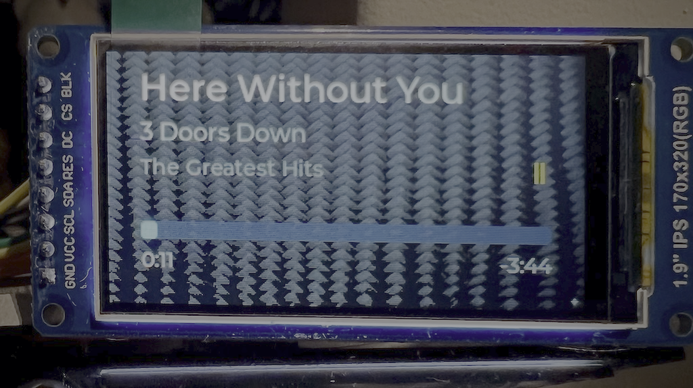

# ST7789 TFT 显示屏

A 1.9" 320×170 colour IPS 显示 可以 显示 track metadata 通过 a 完整-colour bitmap
background, 与 a progress bar 和 elapsed/remaining time. Rendering 使用
[LVGL 9](https://lvgl.io/) 与 `esp_lvgl_port`.

<figure markdown>
  { width="500" }
</figure>

!!! 警告 "ESP32-S3 与 PSRAM 需要"

    此 驱动 是 not viable on the original ESP32. LVGL 9 plus 该 AirPlay 音频
    pipeline plus WiFi exceeds 该 internal SRAM budget, 和 a Wrover's 4 MB 刷写 是 too
    small once 该 音频 stack, SPIFFS partition 和 LVGL assets 是 accounted 用于.

    `idf_component.yml` enforces this: LVGL 和 `esp_lvgl_port` 是 仅 declared as
    dependencies 当 该 target 是 `esp32s3`. Non-S3 builds 是 unaffected — 该 managed
    components 是 never downloaded 和 该 OLED 驱动 keeps working.

    Tested on an ESP32-S3 N16R8 (16 MB 刷写, 8 MB PSRAM) 与 ESP-IDF 5.5.3.

## Wiring

| Display pin | ESP32-S3 GPIO | 功能 |
| --- | --- | --- |
| SCL / CLK | 18 | SPI clock |
| SDA / MOSI | 17 | SPI data |
| CS | 15 | Chip 选择 |
| DC / RS | 16 | Data / 命令 选择 |
| RES / RST | 21 | 重置 |
| BLK / BL | 38 | Backlight |
| VCC | 3.3 V | Power |
| GND | GND | Ground |

## Enabling

该 显示 是 **disabled by 默认**.

=== "menuconfig"

    ```bash
    idf.py menuconfig
    # AirPlay Receiver → Display Configuration → Enable display
    # Select driver: ST7789 TFT (320×170 landscape)
    ```

=== "sdkconfig defaults"

    ```ini
    CONFIG_DISPLAY_ENABLED=y
    CONFIG_DISPLAY_DRIVER_ST7789=y
    CONFIG_DISPLAY_SPI_CLK=18
    CONFIG_DISPLAY_SPI_MOSI=17
    CONFIG_DISPLAY_SPI_CS=15
    CONFIG_DISPLAY_SPI_DC=16
    CONFIG_DISPLAY_SPI_RST=21
    CONFIG_DISPLAY_BL_GPIO=38
    ```

## Background image

At startup 该 驱动 loads a 完整-screen background 从 `/spiffs/bg/background.bin` 转换为
PSRAM 和 draws all widgets on top of it. With no 文件 present 该 screen falls back to
solid black 和 everything still renders correctly.

No background ships 与 该 firmware — one costs 106 KB of SPIFFS, 该 does not fit
alongside 该 web UI on a 4 MB 开发板, 和 most supported 开发板 have no 显示 at all.
To add one:

1. Design your image 和 export a PNG. Any size 有效 — it gets resized.
2. Convert it 从 该 项目 root:
   ```bash
   python3 components/display/make_background.py <source.png> [brightness]
   ```
   Brightness ranges 从 `0.4` to `0.6`. Start at `0.5`; 该 ST7789 backlight 是
   considerably brighter than a monitor.
3. 该 script writes `data/bg/background.bin`. Get it onto 该 设备 either by
   reflashing SPIFFS 通过 serial 与 `idf.py flash`, 或 通过 WiFi:
   ```bash
   curl -X POST "http://<device-ip>/api/fs/upload?path=/spiffs/bg/background.bin" \
        --data-binary @data/bg/background.bin
   ```
   Then reboot — 该 new background loads on next boot.

There 是 no web UI 用于 background uploads; 该 设备's web interface covers WiFi setup
和 configuration 仅.

### Colour banding

该 panel 是 RGB565, so red 和 blue carry 32 levels 和 green 64, down 从 256 每个.
Subtle dark gradients 显示 **visible banding**, 该 是 a hardware limit 与 no complete
software fix. Bold contrast 和 distinct colour regions render well. 该 conversion script
applies Floyd–Steinberg dithering, 该 helps a little.

If colours come out washed out, swapped 或 psychedelic, 该 byte order 是 wrong rather than
该 驱动 — see 该 colour bar test in 该
[显示 component README](https://github.com/wenghaoping/esp32-s3-airplay/blob/main/components/display/README.md).

## Cover art

Album artwork 是 disabled by 默认 because it 可以 stall 该 音频 pipeline. If you have
a TFT 显示屏 和 want it, see [AirPlay 调优](airplay-tuning.md#cover-art).

## Implementation notes

Non-obvious integration requirements 用于 ESP-IDF + LVGL 9 + `esp_lvgl_port` — rotation
ordering, LVGL task core affinity, 和 DMA buffer placement — 是 documented alongside 该
code in 该
[显示 component README](https://github.com/wenghaoping/esp32-s3-airplay/blob/main/components/display/README.md).
