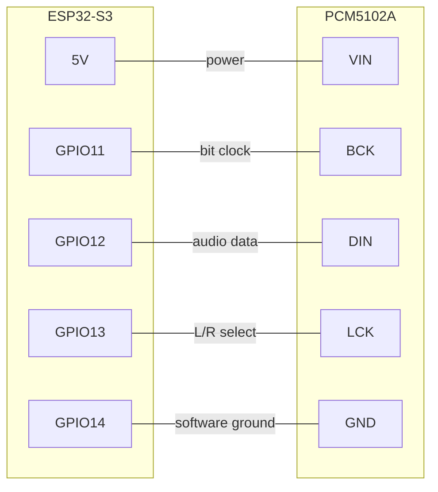
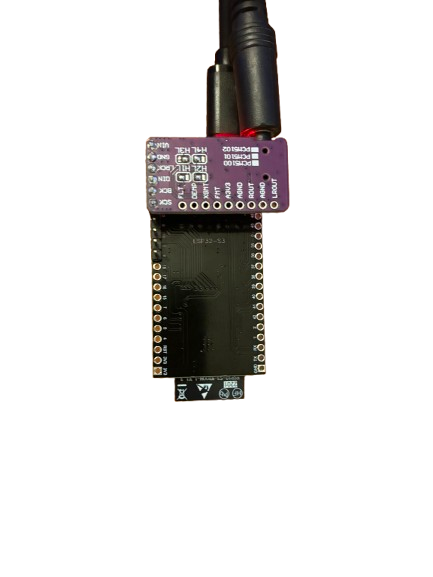
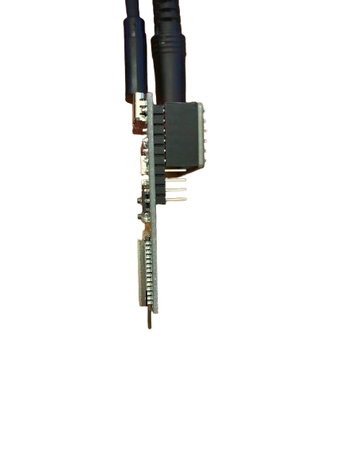

# 组装

No soldering skills needed. 该 PCM5102A plugs 直接 onto 该 ESP32 pins through a
female header — no breadboard, no jumper wires.

## Step 1 — Prepare 该 ESP32

该 pins on **one side** of 该 ESP32 需要 to be removed, 或 simply not soldered on, so
该 assembly fits inside 该 3D-printed case. Only 该 side carrying GPIO11–GPIO14 需要
pins.

If your 开发板 arrived 与 pins already soldered on 两者 sides, carefully desolder 或 clip
该 pins on the opposite side.

## Step 2 — Plug 该 DAC onto 该 ESP32

Take a **female 2.54 mm pin header** (6 pins) 和 push it onto 该 ESP32 pins on 该
GPIO11–14 side. Then insert 该 PCM5102A 转换为 该 female header 从 该 其他 side.

该 connections made through 该 header 是:

| ESP32-S3 pin | PCM5102A pin | 功能 |
| --- | --- | --- |
| 5V | VIN | Power 用于 该 DAC |
| GPIO11 | BCK | 位时钟 (音频 时序) |
| GPIO12 | DIN | Audio data |
| GPIO13 | LCK | Left/right channel 选择 |
| GPIO14 | GND | Software ground, pulled low by 该 firmware |
| GND | GND | Ground — 可选, 该 GPIO14 software ground 是 sufficient |

!!! 警告 "Bridge VIN/VOUT on the ESP32-S3"

    On 该 ESP32-S3 开发板, bridge 该 VIN/VOUT solder pads if they 是 not already
    已连接. 此 lets 该 开发板 take 5 V power 直接. Without it 该 DAC 将 not
    be powered.

## Step 3 — Check 该 result

Your assembly should look like this:

<figure markdown>
  { width="200" }
  <figcaption>Front</figcaption>
</figure>

<figure markdown>
  { width="200" }
  <figcaption>Back</figcaption>
</figure>

<figure markdown>
  { width="150" }
  <figcaption>Side</figcaption>
</figure>

该 PCM5102A sits on top of 该 ESP32 与 该 3.5 mm 音频 jack sticking out 该 end.
Plug a USB-C cable 转换为 该 ESP32 用于 power.

## Step 4 — Print 该 case (可选)

A 3D-printable case 是 provided: [`boite-esp32.stl`](../assets/boite-esp32.stl). Print it
与 standard PLA 设置. 该 case 是 designed 用于 an assembly 与 pins on one side
仅, as described in step 1.

## Next

Head to [Flash 该 firmware](flashing.md).
