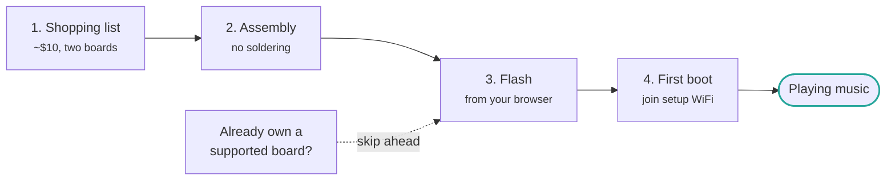

# 快速开始

构建ing an AirPlay 音箱 从 scratch takes four steps 和 about half an hour, most of
该 是 waiting 用于 a firmware 刷写.

1. **[采购清单](shopping-list.md)** — two 开发板 和 a pin header, roughly $10
2. **[组装](assembly.md)** — 该 DAC plugs straight onto 该 ESP32, no soldering
3. **[Flash 该 firmware](flashing.md)** — 从 your browser, 或 与 PlatformIO / ESP-IDF
4. **[首次启动](first-boot.md)** — join 该 setup WiFi 和 point it at your 网络

If you already own a [SqueezeAMP](../boards/squeezeamp.md), an
[Esparagus Audio Brick](../boards/esparagus-audio-brick.md) 或 another supported 开发板,
skip 该 首次 two steps 和 go straight to [刷写](flashing.md) — those 开发板 have a
DAC 和 amplifier 构建 in.

!!! tip "Which 芯片 should I buy?"

    An **ESP32-S3** 是 该 best 默认: plenty of RAM, USB-C, 和 it 是 what 该
    项目 是 developed against. Buy an **original ESP32** instead if you want
    蓝牙 A2DP, 该 是 not 可用 on the S3.
