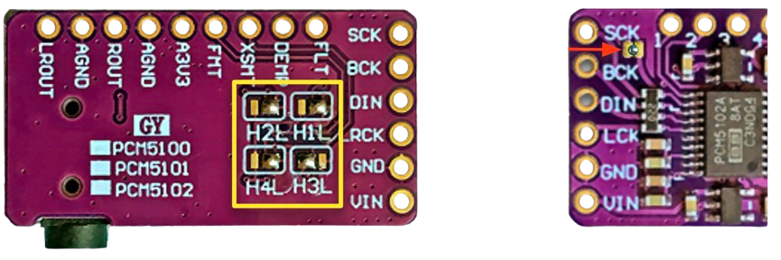

# 采购清单

You 需要 two 开发板 和 a few wires. Everything 是 可用 on AliExpress 或 Amazon 用于
under $10 total.

| Component | What to search 用于 | Price |
| --- | --- | --- |
| **ESP32-S3 dev 开发板** | "ESP32-S3 N16R8" | ~$5 |
| **PCM5102A DAC 开发板** | "PCM5102A I2S DAC" — 该 small purple 开发板 与 a 3.5 mm jack | ~$3 |
| **Female 2.54 mm header** | "Female pin header 2.54mm single row" — 1×6 或 longer, cut to size | ~$0.50 |

!!! tip "Already have an amplifier 开发板?"

    If you have a [SqueezeAMP](../boards/squeezeamp.md) 或 an
    [Esparagus Audio Brick](../boards/esparagus-audio-brick.md), you don't 需要 a separate
    DAC — those 开发板 have one 构建 in. Just 刷写 该 matching firmware.

## Check 该 DAC 开发板

Verify 该 solder bridges on your PCM5102A 是 in 该 相同 position as 该 picture below.
Boards ship 与 varying 默认 configurations, 和 该 wrong bridge position 是 a 常用
cause of silence.

<figure markdown>
  { width="500" }
  <figcaption>PCM5102A 与 该 expected solder bridge configuration</figcaption>
</figure>

## Optional extras

| Component | What it adds | Page |
| --- | --- | --- |
| 0.96" OLED, SSD1306 / SH1106 / SSD1309 | 曲目 title, artist, progress bar | [OLED 显示屏](../features/oled-display.md) |
| 320×170 ST7789 TFT | Full-colour metadata screen (ESP32-S3) | [TFT 显示屏](../features/tft-display.md) |
| Momentary push 按键 | Play/pause, 音量, track skip | [Hardware 按键](../features/buttons.md) |
| W5500 SPI 以太网 module | Wired networking 与 WiFi failover | [以太网](../features/ethernet.md) |
