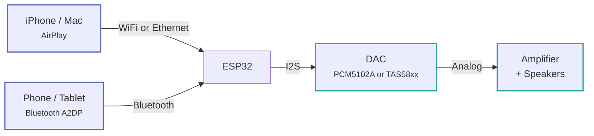
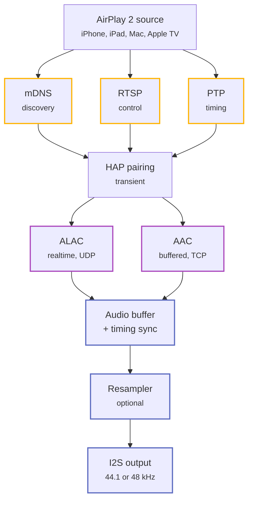
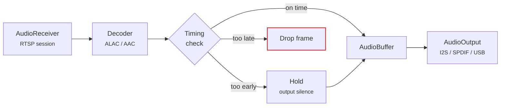
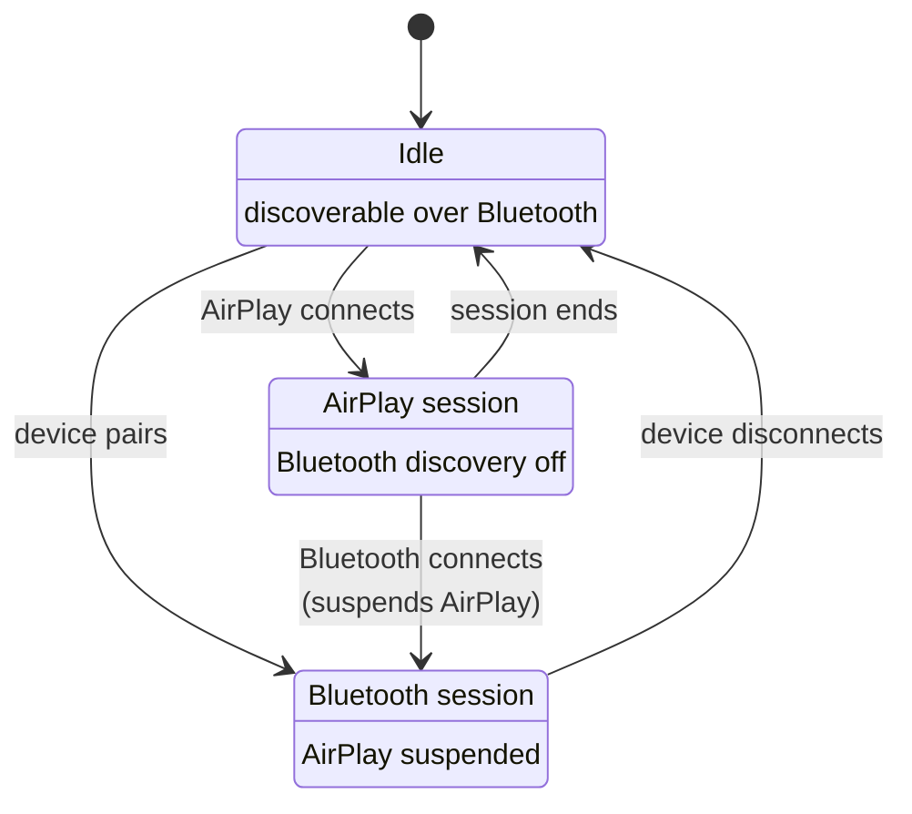

# 系统架构

## 信号流

Audio reaches 该 开发板 通过 该 网络 或 通过 蓝牙, but 从 该 I2S bus onward
两者 sources share one path.



## 协议栈

An AirPlay 2 session 是 really three protocols running side by side. mDNS advertises 该
音箱, RTSP carries 控制, 和 PTP keeps clocks aligned. Only after HomeKit pairing
completes does 音频 start flowing.



## 音频流水线

`AudioReceiver` (RTSP) → decoder → `AudioBuffer` → `AudioOutput` (I2S, S/PDIF 或 USB).

Two 流 types run through it, 和 该 difference between them 是 该 single most
重要 thing to understand 当 debugging 音频 problems.

| Stream | Codec | Transport | Buffering | Timing threshold |
| --- | --- | --- | --- | --- |
| Buffered (AirPlay 2) | AAC | TCP | Deep jitter buffer | 10 ms |
| Realtime (AirPlay 1) | ALAC | UDP | Almost none | 50 ms |

Buffered streams tolerate a tight early/late threshold because 该 jitter buffer absorbs
网络 variation. Realtime streams have almost nothing to absorb 与, so 该 相同 tight
threshold 使 them drop out whenever 该 pipeline stalls — 当 metadata arrives, 用于
instance. That 是 why 该 two have separate 设置; see
[AirPlay 调优](../features/airplay-tuning.md#early-and-late-时序-thresholds).



## I2S 信号

| Signal | 功能 |
| --- | --- |
| BCK | 位时钟 — 44100 × 16 × 2 = 1.41 MHz |
| LCK | 字选择时钟 — toggles at 44.1 kHz |
| DIN | 串行音频数据, 16-bit stereo |

MCLK 是 not used by 该 PCM5102A, 该 generates it internally. It 是 still routed to
GPIO8 by 默认, 该 是 handy 用于 driving another converter such as a WM8805
I2S-to-S/PDIF bridge.

## 运行时共存规则

**AirPlay 和蓝牙互斥。** A 蓝牙 连接 suspends AirPlay;
disconnecting resumes it. While an AirPlay session 是 active 该 设备 stops being
discoverable 通过 蓝牙, so a stray phone 无法 interrupt 播放.



**启动时优先使用以太网而不是 Wi-Fi**, 和 两者 是 hot-swappable at runtime. See
[以太网](../features/ethernet.md) 用于 该 完整 failover behaviour.

**双核构建中，显示任务运行在核心 0，音频任务运行在核心 1** on dual-core builds. Letting 该
LVGL task migrate to core 1 causes progressive 音频 buffer backpressure — latency climbs
无需 recovering until 该 流 misaligns.

## 源码结构

```text
main/
├── main.c                      # Entry point — NVS, WiFi, AirPlay services
├── settings.c                  # NVS persistence
├── audio/
│   ├── audio_receiver.c        # RTSP session manager
│   ├── audio_stream_buffered.c # AirPlay 2 AAC, deep jitter buffer
│   ├── audio_stream_realtime.c # AirPlay 1 ALAC, low-latency UDP
│   ├── audio_decoder.c         # ALAC and AAC decoders
│   ├── audio_buffer.c          # Frame buffering
│   ├── audio_timing.c          # PTP-based early/late frame handling
│   ├── audio_resample.c        # 44.1 → 48 kHz conversion
│   ├── audio_output*.c         # I2S, S/PDIF and USB backends
│   └── a2dp_sink.c             # Bluetooth A2DP sink
├── rtsp/                       # RTSP server, handlers, crypto, FairPlay
├── hap/                        # HomeKit pairing — SRP, Ed25519
├── plist/                      # Apple property list parsing
├── network/                    # WiFi, Ethernet, mDNS, PTP, NTP, web server, OTA
├── dacp_client.c               # DACP remote commands
├── playback_control.c          # Unified playback abstraction
└── buttons.c                   # Debounced button input

components/
├── dac/                        # Abstract DAC API, Kconfig-selected
├── dac_tas57xx/                # TAS5756/5754/5751 with hybrid flow DSP
├── dac_tas58xx/                # TAS5825M with on-chip DSP and 15-band EQ
├── display/                    # OLED (u8g2) and ST7789 (LVGL 9) drivers
├── boards/                     # Per-board HAL — GPIOs, SPI bus, init
├── spiffs_storage/             # SPIFFS mount
├── audio-resampler/            # Sinc-based resampler
└── board_utils/                # Board-level utilities
```

## Key components

| Module | Location | Purpose |
| --- | --- | --- |
| RTSP server | `main/rtsp/` | AirPlay 控制 messages |
| HAP pairing | `main/hap/` | Cryptographic 设备 pairing |
| 音频流水线 | `main/audio/` | Decoding, buffering, 时序 |
| A2DP sink | `main/audio/` | 蓝牙 音频 receiver, ESP32 仅 |
| PTP clock | `main/network/` | Synchronisation 与 该 源码 |
| WiFi | `main/network/` | AP+STA management, captive portal |
| 以太网 | `main/network/` | W5500 SPI 驱动 |
| Web server | `main/network/` | 配置 interface |
| DAC abstraction | `components/dac/` | Kconfig-selected DAC API |
| Board support | `components/boards/` | Per-开发板 HAL |
| Display | `components/display/` | OLED 或 ST7789 TFT |
| SPIFFS storage | `components/spiffs_storage/` | Filesystem mount |
| 按键 | `main/buttons.c` | Debounced 按键 input |

## Conventions

- **Kconfig drives 开发板 selection.** 该 DAC 驱动 是 chosen 自动 via
  `CONFIG_DAC_TAS57XX` 或 `CONFIG_DAC_TAS58XX`. Display, 按键, 蓝牙 和 以太网
  是 all Kconfig-gated 和 compile out entirely 当 disabled.
- **Each component has its own `CMakeLists.txt`** 与 `idf_component_register()`.
- **`u8g2` 和 `u8g2-hal-esp-idf` 是 git submodules** — always clone 与 `--recursive`.
