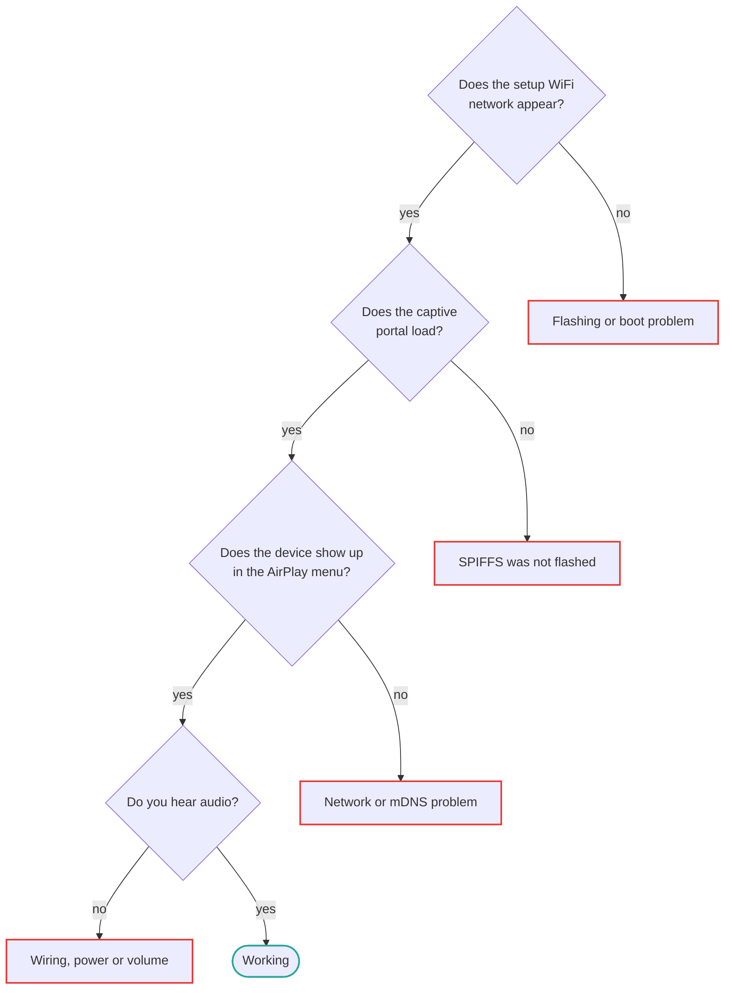

# 故障排除

Organised by symptom. Most reports fall 转换为 该 首次 three sections.

## 从这里开始



Work down that chain — 每个 stage depends on the one before it, so fixing 该 earliest
failure often resolves everything after it:

| Where it breaks | Section |
| --- | --- |
| 刷写固件 或 boot problem | [No setup 网络 appears](#no-esp32-airplay-setup-network-appears) |
| SPIFFS 是 not flashed | [该 captive portal says "文件 not found"](#the-captive-portal-says-file-not-found) |
| Network 或 mDNS problem | [该 设备 does not appear in AirPlay menus](#the-device-does-not-appear-in-airplay-menus) |
| Wiring, power 或 音量 | [Nothing at all, but 该 设备 显示 up](#nothing-at-all-but-the-device-shows-up-in-airplay) |

## Setup 和 首次 boot

### 该 captive portal says "文件 not found"

该 SPIFFS partition holding 该 web 页面 是 not flashed. PlatformIO's `-t upload`
writes firmware 仅.

```bash
pio run -e <env> -t uploadfs
```

With ESP-IDF, `idf.py flash` writes firmware 和 SPIFFS together, so this does not happen.
See [SPIFFS filesystem](reference/spiffs.md#flashing-the-image).

### No `ESP32-AirPlay-Setup` 网络 appears

Work through these in order:

1. **Wait 30 seconds** after power-up. 该 AP comes up after NVS 和 WiFi initialisation.
2. **Check 该 serial monitor** at 115200 baud (`pio run -e <env> -t monitor`). A boot
   loop 或 a crash before 该 WiFi task starts 将 be visible there.
3. **Confirm the flashing actually succeeded.** A merged `.bin` must be written at offset
   `0x0`. Writing it at `0x10000` produces a 开发板 that appears to 刷写 fine 和 then
   does nothing.
4. **Check you flashed 该 right binary** 用于 your 芯片. An ESP32 image on an ESP32-S3
   将 not boot. See [构建 环境](reference/build-environments.md).
5. **Look 用于 saved credentials.** If 该 设备 already has WiFi credentials it joins
   that 网络 instead of starting 该 AP. Erase 刷写 to reset:
   `esptool.py erase_flash`.

### 该 设备 never joins my WiFi

Only 2.4 GHz networks 是 supported, except on the ESP32-C5 该 是 dual-band. WPA3-仅
networks 将 not 工作 — 设置 your router to WPA2 或 WPA2/WPA3 mixed mode. After several
failed attempts 该 设备 returns to setup mode on its own.

## No sound

### Nothing at all, but 该 设备 显示 up in AirPlay

Almost always wiring 或 power on an external DAC 构建.

1. **Bridge 该 VIN/VOUT pads on the ESP32-S3.** They ship open on most 开发板, so 该 DAC
   gets no 5 V. 此 是 该 most 常用 cause.
2. **Check 该 PCM5102A solder bridges** against
   [该 reference photo](getting-started/shopping-list.md#check-the-dac-board).
3. **Verify 该 I2S pins** match [该 defaults](boards/esp32s3-pcm5102a.md#default-i2s-pins)
   — BCK on GPIO11, DIN on GPIO12, LCK on GPIO13.
4. **Check 该 音量.** Both 该 sender's 音量 和 该 设备's own 设置 in 该 web
   interface apply.

### Sound 从 an iPhone but not 从 a Windows sender

Windows AirPlay senders such as TuneBlade generally speak AirPlay 1 与 a realtime ALAC
流 通过 UDP, 该 takes a 不同 path through 该 firmware than AirPlay 2 从
iOS. If it connects but stays silent, try raising 该 realtime 时序 threshold — see
[below](#dropouts-crackling-or-stuttering).

注意 that Apple Music on Windows 是 not supported as a sender.

### Silence after pause 和 resume

Fixed in recent firmware. If you 是 on an older 构建, 更新 — see
[OTA 更新](reference/ota.md).

## Playback quality

### Dropouts, crackling 或 stuttering

Start 与 该 realtime 时序 threshold, especially on AirPlay 1 / ALAC streams 其中
there 是 almost no jitter buffer:

```ini
CONFIG_AIRPLAY_RT_TIMING_THRESHOLD_MS=100
```

该 默认 是 50 ms. Raising it trades slightly looser sync 用于 resilience 当 该
pipeline stalls. Full explanation in
[AirPlay 调优](features/airplay-tuning.md#early-and-late-时序-thresholds).

Other things that help:

- **禁用 cover art** if you enabled it. Artwork transfer 可以 stall 该 音频 pipeline.
  It 是 off by 默认 用于 this reason.
- **Improve WiFi signal.** 该 receiver 需要 a consistent 连接; a marginal signal
  produces exactly this symptom.
- **Use 以太网** if your 开发板 supports it — see [以太网](features/ethernet.md).

### Out of sync 与 a HomePod in multi-room

Multi-room sync relies on PTP 时序 和 是 sensitive to 网络 jitter. Sync quality 也
varies by sender: 不同 iPhone models have shown 不同 behaviour against 该 相同
receiver. There 是 no configuration that fully resolves this today.

### Audio drops out 当 a 显示 是 已连接

On dual-core builds all 显示 工作 must stay on core 0 so core 1 是 free 用于 音频. If
you 是 building a custom 显示 integration, see 该 LVGL task affinity notes in 该
[显示 component README](https://github.com/wenghaoping/esp32-s3-airplay/blob/main/components/display/README.md).

## Discovery

### 该 设备 does not appear in AirPlay menus

1. **Same 网络.** 该 sender 和 receiver must be on the 相同 subnet. Guest networks
   和 client isolation break mDNS.
2. **Flush 该 macOS mDNS cache** if 该 设备 previously crashed — macOS caches AirPlay
   设备 state 和 becomes conservative about a 设备 it has seen disappear repeatedly:
   ```bash
   sudo dscacheutil -flushcache
   ```
3. **Check mDNS 是 not blocked.** Some routers filter multicast between wireless clients.

### 该 设备 name 显示 garbled characters

Non-ASCII 设备 names, Cyrillic 用于 示例, 是 mangled in mDNS advertisements in older
firmware. 更新 to a recent 构建.

## 构建ing

### Compilation fails immediately

**Missing submodules** 是 该 usual cause. `u8g2` 和 `u8g2-hal-esp-idf` 是 git
submodules:

```bash
git submodule update --init --recursive
```

Clone 与 `--recursive` to avoid this in 该 首次 place.

**Wrong ESP-IDF version.** 该 项目 requires **v5.5.5 或 newer**. Sendspin 需要 该
WebSocket post-handshake callback added in that 发布版本; an older 5.5.x builds 仅 与
`CONFIG_SENDSPIN_ENABLE=n`. PlatformIO gets 5.5.5 从 该 pioarduino platform pinned in
`platformio.ini`; 该 official `platformio/espressif32` platform 是 still on 5.5.3.

### Changes to sdkconfig defaults have no effect

A generated `sdkconfig.<env>` 是 cached in 该 项目 root 和 takes priority. Delete it
和 rebuild:

```bash
rm sdkconfig.<env>
pio run -e <env> -t build
```

### PlatformIO 无法 find a platform 用于 my 芯片

该 official `platformio/espressif32` platform does not support 该 ESP32-C5, 和 是 stuck
on ESP-IDF 5.5.3. `platformio.ini` pins 该 community pioarduino platform 用于 每个
环境 instead — see [Seeed XIAO ESP32-C5](boards/xiao-esp32c5.md).

## Still stuck?

Search 该 [issue tracker](https://github.com/wenghaoping/esp32-s3-airplay/issues?q=is%3Aissue)
including closed issues, then open a new one 或 start a
[discussion](https://github.com/wenghaoping/esp32-s3-airplay/discussions).

Include your 开发板, 该 构建 环境 或 prebuilt binary you used, 该 firmware
version, 和 serial output at 115200 baud. Serial output 使 该 difference between a
guess 和 a diagnosis.
