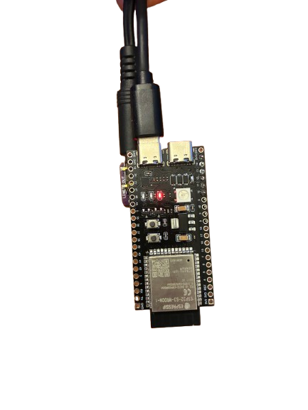

# ESP32 AirPlay 2 接收器

**将 Apple 设备上的音乐，或任意手机通过蓝牙播放的音乐，传到任意音箱，成本约 10 美元。**

本固件可以将廉价的 ESP32 开发板变成无线 AirPlay 2 音箱。把它连接到功放或有源音箱后，它会像 HomePod 或支持 AirPlay 的电视一样出现在 iPhone、iPad 或 Mac 上。

无需云服务，无需 App，点击即可播放。

!!! tip "已经有开发板？现在就安装"

    通过 USB 连接开发板并点击“安装”。无需工具链、下载或命令行，浏览器会直接与开发板通信。

    <esp-web-install-button manifest="/esp32-s3-airplay/firmware/esp32s3.json">
      <button slot="activate" class="md-button md-button--primary">安装到 ESP32-S3</button>
      当前浏览器无法通过 USB 刷写，请在桌面端使用 Chrome、Edge 或 Opera。
      刷写需要安全的 HTTPS 连接。
    </esp-web-install-button>

    此按钮适用于通用 **ESP32-S3**。SqueezeAMP、Esparagus、Waveshare 及其他开发板，请查看[刷写页面中的全部开发板](getting-started/flashing.md)。需要桌面端 Chrome、Edge 或 Opera。

-   __第一次使用？__

    购买两块开发板，将它们连接起来，然后通过浏览器刷写。

    [从这里开始](getting-started/index.md)

-   __已经有开发板？__

    支持 SqueezeAMP、Esparagus Audio Brick、XIAO ESP32-C5 等开发板。

    [选择开发板](boards/index.md)

-   __遇到问题？__

    设置 Wi-Fi 失败、没有声音、网页缺失或构建报错。

    [故障排除](troubleshooting.md)

-   __想参与开发？__

    了解构建环境、音频流水线和协议栈。

    [系统架构](reference/architecture.md)

## 你将构建的设备

<figure markdown>
  { width="240" }
  <figcaption>两块开发板、一排排针、无需焊接；3.5 mm 插孔连接到功放</figcaption>
</figure>

## 30 秒了解工作原理

手机会在网络上发现 AirPlay 音箱。ESP32 接收并解码加密音频流，与发送端保持时钟同步，然后通过 I2S 将音频送到 DAC，DAC 再驱动功放。完整说明请参阅[系统架构](reference/architecture.md)。

## 支持的硬件

支持 **ESP32**、**ESP32-S2**、**ESP32-S3** 和 **ESP32-C5** 芯片，包括搭配外置 I2S DAC 的普通开发板，以及多种集成功放板：

- [SqueezeAMP](boards/squeezeamp.md)：ESP32 + TAS5756 DAC 和 D 类功放
- [Esparagus Audio Brick](boards/esparagus-audio-brick.md)：ESP32 或 ESP32-S3 + TAS58xx DAC/功放、片上 DSP、以太网
- [Esparagus Audio Brick Dual](boards/esparagus-audio-brick-dual-dac.md)：ESP32-S3 + 双功放、主动分频、USB 音频
- [ESP32-S3 + PCM5102A](boards/esp32s3-pcm5102a.md)：最便宜的方案，无需焊接

基于 ESP32 的开发板还支持 **蓝牙 A2DP**，因此任何能与蓝牙音箱配对的设备，都可以在 AirPlay 空闲时向它们播放音频。

## 功能特性

- **AirPlay 2**：原生出现在控制中心和所有支持 AirPlay 的 App 中
- **ALAC 和 AAC 解码**：支持实时流媒体和音乐播放
- **多房间播放**：使用 PTP 时钟同步
- **蓝牙 A2DP**：接收手机和平板的音频（仅 ESP32 开发板）
- **W5500 以太网**：有线联网，并自动切换 Wi-Fi
- **网页配置**：在浏览器中设置 Wi-Fi 和设备名称
- **OTA 更新**：通过 Wi-Fi 更新，首次刷写才需要 USB
- **48 kHz 输出**：可选 44.1 → 48 kHz 转换
- **显示屏**：可选 OLED 或 320×170 彩色 TFT，显示曲目元数据和进度
- **硬件按键**：可选播放/暂停、音量和切换曲目按键

### 限制

- 仅支持音频，不支持 AirPlay 视频或照片
- 每块 ESP32 开发板连接一个音箱
- 需要良好的 Wi-Fi 信号才能稳定播放

## 致谢

- [Shairport Sync](https://github.com/mikebrady/shairport-sync)：参考 AirPlay 实现
- [openairplay/airplay2-receiver](https://github.com/openairplay/airplay2-receiver)：Python AirPlay 2 实现
- [Espressif](https://github.com/espressif)：ESP-IDF 框架和编解码库

## 许可与法律声明

**仅限非商业用途。**商业使用需要获得明确许可，请参阅 [LICENSE](https://github.com/wenghaoping/esp32-s3-airplay/blob/main/LICENSE)。

这是一个基于协议分析的独立项目，与 Apple Inc. 没有隶属关系，不保证兼容未来版本的 iOS 或 macOS，按“现状”提供且不附带任何保证。
